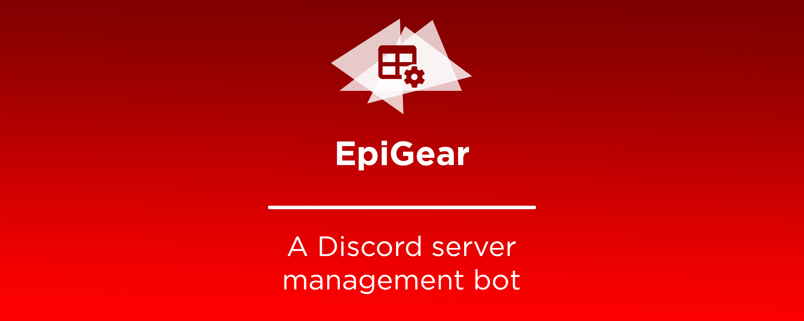

# EpiGear


[](https://opensource.org/licenses/MIT)



## About

EpiGear is a discord bot for server creation, and includes several points.
- Creation of permission groups
- Creation of roles based on permissions
- Creation of a channel and category according to these permissions
- Update of the channels and roles even after their creation
- All based on a configuration file
- 

EpiGear is a project by [gastbob40](https://github.com/gastbob40) and [Baptman21](https://github.com/bat021).

## How to install it ?

1. **First, you will have to clone the project.**

```shell
git clone https://github.com/gastbob40/epigear
```

2. **Create a `virtual environment`, in order to install dependencies locally.** For more information about virtual environments, [click here](https://docs.python.org/3/library/venv.html).

```shell
python -m venv .venv
```

3. **Activate the virtual environment**

Linux/macOS:

```shell
# Using bash/zsh
source .venv/bin/activate
# Using fish
. .venv/bin/activate.fish
# Using csh/tcsh
source .venv/bin/activate.csh
``` 

Windows:

```
# cmd.exe
.venv\Scripts\activate.bat
# PowerShell
.venv\Scripts\Activate.ps1
```

4. **Finally, install the dependencies**

````shell
pip install requirements.txt
````

5. **Configure EpiGear**. This is necessary to use the bot. Check the next section for instructions.

6. **Run `python index.py` to launch EpiGear.** Also make sure that the venv is activated when you launch EpiGear (you should see `venv` to the left of your command prompt).

## How it works ?

The `run` folder contains all the data of the program configuration.

### config_bot

This folder contain a single file, `default.config.yml`. This file looks like this:
 
```yaml
# General information
discord_server_id: ~
current_promo: ~
token: ~

# Clear information
clear: false
channels_to_ignore: ~ 
roles_to_ignore:   
    - '@everyone' 
```

You will therefore have to modify in this file the `discord_server_id` by the one of the server where you want to run the bot.
Also remember to put the `token` of your bot discord.

You can also choose to delete the roles and channels of the server in question before creating the new roles and channels.
The `channels_to_ignore` and `roles_to_ignore` are lists of name of role / channel

### config_server

This folder contains the configuration of permissions groups, roles and channels.

#### `perms_groups.yml`

This file contains the names of the permission groups and their correspondence to Discord.
Each group correspond to certain settings that can be used in the rest of the configuration file to set permissions to different roles
You can therefore add or remove groups.

For example:

```yaml
READ_ONLY: #the name of the group
  read_messages: true     # One permission (read_messages) and its value (true)
  send_messages: false    # One permission (send_messages) and its value (false)
```
Here is the list of all the permissions:

```yaml
# Moderation permission
create_instant_invite: true
administrator: true
kick_members: true
ban_members: true
view_audit_log: true
manage_nicknames: true
manage_roles: true
manage_emojis: true
manage_webhooks: true
manage_channels: true
manage_guild: true

# General permission
change_nickname: true
add_reactions: true

# Text channels permissions
read_messages: true
send_messages: true
send_tts_messages: true
manage_messages: true
embed_links: true
attach_files: true
read_message_history: true
mention_everyone: true
external_emojis: true

# Voice channels permissions
connect: true
speak: true
mute_members: true
deafen_members: true
move_members: true
use_voice_activation: true
priority_speaker: true
```

When you create a group of permissions, you don't have to set all the permissions to true or false.
If a permission is not in the list, it will be set by default to false for the server perm, and to Neutral for the channels perm. 

#### `roles.yml`

This file contains the list of roles and their specificity.

For example:

```yaml
EXTERNE:  # The name of the role object, used in channel definition
  name: Externe             # The name of the role (on discord)
  color: 0xc0ff00           # The color of the role
  permissions: DEFAULT      # The permission group of the role (link to perms_groups.yml)
  hoist: true               # If the role is hoist or not
  mentionable: false        # If the mentionable is hoist or not
```

#### `server_channels.yml`

The file contains the list of categories and channels for the server

For example:

```yaml
epita_promo:                    # The name of the object
  name: EPITA/PROMO             # The name of the category
  overwrites:                   # The general permission of the category
    PROMO_N: READ_AND_WRITE     # Role (from roles.yml): perms group (from perms_group.yml)
  default_perm: HIDDEN          # Default perm (for everyone role)

  channels:                     # The list of texts channel
    promo:                      # The name of the object
      name: PROMO               # The name of the channel (in discord)
      overwrites:               # The overwritten permission
        STAFF_EPILOGIN: SERVER_ADMIN_PERM   # Role (from roles.yml): perms group (from perms_group.yml)
        ADMIN: ADMIN_PERM
      default_perm: HIDDEN      # Default perm (for everyone role)

  vocal_channels:               # The list of voice channel
    general:                    # The name of the object
      name: General             # The name of the voice channel (in discord)
      overwrites: ~             # The overwritten permissions
      default_perm: HIDDEN      # The default perm
```

Note that in discord, the name of the channels and categories follow some rules :
 - the name of a category is in upper case (example: My Category -> MY CATEGORY)
 - the name of a channel (text or vocal) is in lower case and space will be filled with '-' (example: My Text Channel -> my-text-channel)

You can write the names you want in the config file but they will not appear in discord as they are written here

To start the bot, just start the `index.py` file in the `run` folder.

## Config Builder Mod

In addition to the default mode that allows you to create channels, you can use the bot to create a config from a server.
To do that use the argument :  
```
-m build
```

The bot will then read the roles and channels from the server that you specified in `config.yml`
and create 2 news files `roles_name_of_the_server.yml` and `server_channels_name_of_the_server.yml` that you can use 
afterward to build another server with thing config.

In those config files, the permission groups are set map to the ones in `perms_groups.yml`. If the permission
of a role does not correspond to any of the perm groups in the config, then the group `UNKNOWN` is set in the config.
